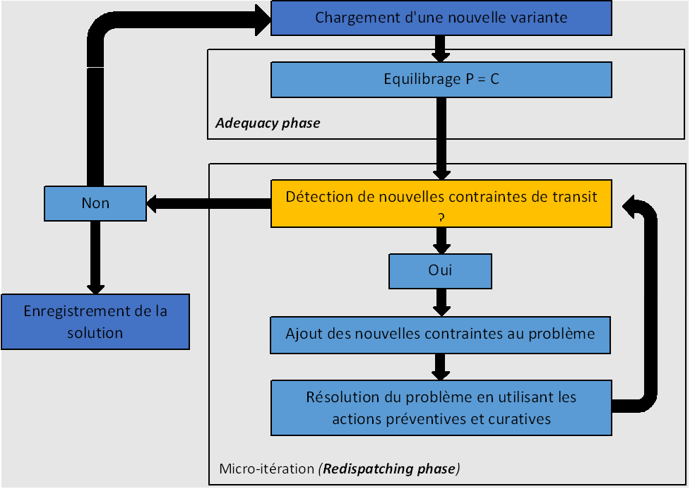
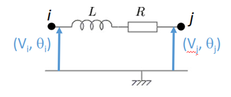

# Introduction
Dans le cadre des activités de RTE, il faut un outil capable, pour un réseau donné, **de simuler son fonctionnement heure par heure** et de fournir une **estimation de son coût d’exploitation, en situation normale et face à différents incidents**. Cela est, par exemple, nécessaire pour l’étude du développement du réseau électrique. 

METRIX comprend à la fois un calcul de réseau (load-flow) en actif seul, un modèle d’optimisation de flux (Optimal Power Flow ou OPF) et un modèle d'optimisation de 
Un **load-flow** calcule la répartition des flux sur les ouvrages du réseau en fonction des caractéristiques de ces ouvrages et des injections du réseau (production et consommation). Le résultat d’un load-flow permet de constater les contraintes.
Un **OPF** peut modifier les injections/consommations et la topologie de sorte, qu’après load-flow, il n’y ait pas de contrainte sur les ouvrages.
L’objectif de METRIX est de trouver l’ajustement de moindre coût du plan de production de sorte à n’avoir aucune contrainte de transit ni en N ni sur incidents. Il permet de mesurer le surcoût engendré par le réseau sur le plan de production initial et permet de valoriser un renforcement de réseau.
Dans sa version 6, METRIX est intégré dans la plate-forme imaGrid où il peut être lancé sur des milliers de variantes. Ces variantes permettent de modéliser des incertitudes sur la consommation, la production renouvelable, la disponibilité des groupes, etc.
Afin d’obtenir un problème plus facile et rapide à résoudre, METRIX utilise l’approximation du courant continu pour modéliser le réseau. Cette simplification ne permet pas de détecter les contraintes de tension et encore moins les problèmes liés à la dynamique des événements.
imaGrid envoie à METRIX un cas de base ainsi qu’un fichier annexe décrivant toutes les variantes à calculer. METRIX applique chacune des variantes au cas de base et retourne un résultat pour chaque variante. Les résultats sont présentés sous forme de chroniques dans imaGrid.
Ce document présente la modélisation du système électrique utilisée par METRIX, le problème d’optimisation qu’il résout, les fonctionnalités disponibles et les sorties qu’il fournit.

# Objectif

Le but de Metrix est de de fournir une estimation du coût d’exploitation horaire d’un réseau fonctionnant de manière optimal, i.e. coûtant le plus faible possible.

Considérons un réseau donné. Le comportement d’un réseau étant aléatoire, le coût d’exploitation l'est également. Posons $X$ la variable aléatoire du coût d’exploitation de ce réseau. Ce que nous voulons calculer avec Metrix, c’est une minimisation de l’espérance de cette variable aléatoire :

$$
\begin{aligned}
min(\mathbb{E}(X))
\end{aligned}
$$

Puisque nous ne disposons pas de loi pour déterminer cette espérance, nous allons utiliser une approche statistique et l’approximer comme la moyenne d’un grand nombre de réalisations équiprobables. Il va donc falloir déterminer le coût d’exploitation du réseau sur un grand nombre d’heures (que nous nommerons variantes). En notant $n$ le nombre de réalisations :

$$
\begin{aligned}
min(\mathbb{E}(X)) \approx  min(\frac{1}{n}\sum_{i=0}^{n}x_i)
\end{aligned}
$$

D'autre part, pour simplifier le modèle et paralléliser les simulations des variantes, il a été décidé de les rendre indépendante les unes des autres : la réalisation de la variable sur une variante est totalement indépendante de sa réalisation sur une autre variante. Par conséquent, minimiser la somme des coûts revient à minimiser chaque coût horaire :

$$
\begin{aligned}
min(\mathbb{E}(X)) \approx  min(\frac{1}{n}\sum_{i=0}^{n}x_i) = \frac{1}{n}\sum_{i=0}^{n}min(x_i)
\end{aligned}
$$

Pour estimer le minimum de l’espérance de $X$, nous allons donc devoir minimiser le coût de fonctionnement du réseau de chaque variante, et ce, sur un grand nombre de variantes. Cela équivaut à simuler, pour chaque variante, un fonctionnement optimal du réseau. Pour ce faire, nous allons utiliser les outils de **Recherche Opérationnelle**.
Par ailleurs, pour avoir des variantes différentes, nous allons avoir besoin de situations différentes dans le réseau : en termes de coûts de production, de groupes indisponibles, de consommations des centres de consommation, etc. Ces paramètres du réseau seront représentés par des variables aléatoires, chaque variante ayant sa réalisation. Metrix résout donc un problème d’**optimisation stochastique**.

## Énoncé du problème
Pour simuler le fonctionnement réel et optimal du réseau sur une variante, nous allons décomposer le problème en deux problèmes d’optimisation, résolus l’un après l’autre.

METRIX n’est pas un modèle destiné à l’optimisation fine de la production. De ce fait, la modélisation des groupes est simplifiée. En tant que modèle statique, METRIX ignore la dynamique de démarrage des groupes et certaines contraintes de fonctionnement des différents moyens de production. METRIX ne connaît que leurs bornes de variations et leurs coûts. Tous les groupes sont décrits de la même manière indépendamment de leur type.
Dans les phases d’équilibrage et de redispatching, METRIX tient toujours compte de la puissance maximale (*Pmax*) du groupe.
En revanche, dans la phase d’équilibrage, METRIX ne tient pas compte de la puissance minimale (*Pmin*) si celle-ci est positive. En d’autres termes, METRIX peut donc démarrer un groupe entre 0 et Pmax. En pratique, cela se produit tout au plus pour le groupe marginal (dernier groupe ajusté).
Dans la phase de redispatching les Pmin sont prises en compte et METRIX ne peut donc pas arrêter un groupe qui est démarré dans la phase d’équilibrage.
Il est possible de contrôler pour chaque groupe sa participation dans chacune des phases via la définition de coûts. À chaque groupe, nous pouvons associer :
- Le coût d’équilibrage à la hausse qui représente le coût de production par MW utilisé dans la phase d’équilibrage.
- Le coût d’équilibrage à la baisse est utilisé dans la phase d’équilibrage.
- Le coût de redispatching à la hausse correspond au coût d’augmentation en préventif de la puissance de consigne du groupe dans le mécanisme d’ajustement. Ce coût est également utilisé en curatif.
- Le coût de redispatching à la baisse correspond au coût de baisse en préventif de la puissance de consigne du groupe dans le mécanisme d’ajustement. Ce coût est également utilisé en curatif.
Pour une même phase il faut toujours définir un coût à la hausse et à la baisse.
Le coût de démarrage des groupes n’est pas pris en compte par METRIX.

## Convention de signe
Soit un coût à la hausse $C+$ et un coût à la baisse $C-$. Si nous augmentons la production du groupe de $\Delta P+$, cela coûtera $C+ \times \Delta P+$. Si nous baissons la production de $\Delta P-$ ($\Delta P-$ est positif), cela coûtera $C- \times \Delta P-$.
Avec un coût positif, cela « coûte » de modifier une production.
Avec un coût négatif, cela « rapporte » de modifier une production.
En conséquence, si des valeurs négatives sont utilisées pour les coûts à la baisse et que le coût à la baisse d’un groupe est supérieur en valeur absolue au coût à la hausse d’un autre groupe, METRIX peut modifier le coût de production uniquement pour bénéficier de cette « opportunité » sans que cela soit motivé par une contrainte d’équilibrage ou de transit. Les paramètres adequacyCostOffset et redispatchingCostOffset permettent de contrer ce comportement dans chacune des phases et doivent être positionnés à la valeur absolue du plus grand coût négatif.
Si rien n’est spécifié (aucun coût n’est défini), tous les groupes du réseau peuvent participer aux deux phases à coût nul.
Dès qu’au moins un groupe est configuré, seuls les groupes pour lesquels un coût est défini pour une phase peuvent participer à cette phase. La consigne de production des autres groupes ne peut pas être modifiée.
Si trop peu de groupes peuvent agir, le modèle peut ne pas pouvoir trouver de solution aux contraintes et retournera un code d’erreur 1 (ex. contrainte d’évacuation sur un groupe non modifiable).

### Premier problème
Tout d’abord, un premier problème d’équilibrage entre production et consommation (***Adequacy phase***), simulant le fait que, suite à un changement de la consommation, les producteurs d’électricité adaptent leur production pour répondre à la nouvelle demande, tout en assurant un coût d’opération minimal. Si la capacité de production est insuffisante, du délestage de consommation est également possible. Le réseau électrique n'est pas pris en compte dans cette phase, nous supposons que tous les éléments producteurs et consommateurs se trouvent sur une même plaque de cuivre sans résistance. Avec la résolution de ce problème, nous obtenons une **égalité production – consommation**. 

Toutes les **variables du problème étant continues**, nous utilisons la **Programmation Linéaire**. Pour garder une approche statistique, le choix des groupes (pour des coûts égaux) se fait **aléatoirement**. Toutefois, pour éviter d’avoir une solution différente à chaque résolution, ce choix aléatoire est identique pour un même environnement informatique. 
Cette étape est explicitée dans [le schéma ci-après](#adequacy_fig) : la situation initiale est déséquilibrée entre la demande (150 MW) et la production (30 + 20 MW). Les groupes augmentent donc leur production, en appelant d’abord les productions les moins chères.

    <figure>
        
        <figcaption>Équilibrage du réseau en <i>Adequacy phase</i></figcaption>
    </figure>

Cf. [Adequacy model](#adeq_math)

### Deuxième problème
Mais puisque les lignes électriques n’ont pas été prises en compte, ce **nouvel équilibre peut entraîner des surcharges sur celles-ci**. Dans une deuxième phase (***Redispatching phase***), il faut donc considérer le réseau dans son intégralité et choisir des **actions préventives** pour éviter les surcharges tout en assurant l’équilibrage Production – Consommation. Ces actions préventives regroupent les moyens d’actions de RTE sur le réseau, à savoir la **modification des déphasages des Transformateurs-Déphaseurs et des flux sur les Lignes à Courant Continu**. Nous avons également la possibilité de modifier la production ou la consommation. Néanmoins, ces actions concernent des acteurs extérieurs à RTE, leur utilisation sera donc défavorisée par un coût plus élevé dans la simulation. 
En outre, des incidents peuvent se produire sur le réseau et perturber son fonctionnement (perte d’un groupe de production, d’une ligne, etc.) ; il faut donc choisir des **actions curatives** pour éviter d’autres surcharges. Ces actions sont les mêmes qu’en préventif, avec, en supplément, des **parades topologiques** : ces dernières ouvrent ou ferment des lignes ou des couplages du réseau, de façon à en modifier la topologie, et donc à modifier les flux sur les lignes. 
La résolution de ce deuxième problème d’optimisation va donc permettre de simuler le choix des actions préventives et curatives garantissant le bon fonctionnement du réseau pour un coût minimal. Certaines actions curatives étant du type “interrupteur”, **des variables booléennes** apparaissent dans le problème : nous résolvons ainsi un **Problème Linéaire Mixte en Nombres Entiers**. 
Le [schéma ci-après](#redis_fig) montre la partie préventive de ce second problème : après l’équilibrage du réseau, les contraintes de seuil des lignes sont ajoutées, ce qui provoque la surcharge d'une ligne. Pour que son seuil ne soit pas dépassé, nous modifions les productions des groupes tout en maintenant l’équilibre offre – demande, ce qui entraîne un surcoût de 200€.

    <figure>
        
        <figcaption>Satisfaction des contraintes du réseau en <i>Redispatching phase</i></figcaption>
    </figure>

Cf. [Redispathcing model](#redis_math)

Voici donc les deux problèmes qui doivent être résolus afin de simuler le fonctionnement du réseau sur la durée souhaitée. Cependant, <r>pour plus de rapidité et pour rester dans une approche statistique</r>, le choix a été fait de **ne pas lier la solution de la variante $t$ à la situation initiale de la variante $t+1$**. Les résultats de chaque variante sont **indépendants** des autres variantes. Dès lors, chaque ensemble de problème {*Adequacy phase*, *Redispatching phase*} est indépendant d’une variante à une autre, et chaque variante peut se résoudre en parallèle.

## Hypothèses et simplifications du problème

### Représentation des lignes et gestion de leurs contraintes

Pour simuler la *Redispatching phase*, nous résolvons un problème d’optimisation incluant des contraintes sur les transits des lignes. Cependant, un réseau est fait d'un très grand nombre de lignes. Sachant que **seules quelques-unes seront intéressantes à surveiller** lors d’une simulation, nous indiquons en entrée de la simulation quelles sont **les lignes dont il faut contraindre le transit** et quelles sont **les lignes qui peuvent être laissées sans surveillance**. Cela permet de réduire la quantité de calculs à faire sans diminuer l’utilité de la simulation.
En outre, de part la structure du problème, **nous pouvons éviter d’ajouter d’emblée toutes les contraintes de transit sur les lignes**. En effet, dans un réseau électrique, si des lignes se trouvent en surcharge, cela est généralement dû à une surcharge sur un groupe réduit de lignes qui transmettent ensuite l’excès à d’autres. En empêchant les surcharges sur ce groupe original de lignes, nous faisons donc disparaître aussi les surcharges sur les autres lignes. **Le problème d’optimisation peut ainsi être simplifié en réduisant le nombre de contraintes** à prendre en compte, sans changer la validité de la simulation. 
Pour résoudre le problème d’optimisation, nous allons **procéder par micro-itérations* : à chaque micro-itération, nous résolvons le problème ; puis nous cherchons si, dans la solution trouvée, il y a des lignes en surcharge. Parmi ces lignes, nous allons rechercher quel sous-groupe de lignes engendre des surcharges ailleurs, et donc quel sous-groupe de lignes il faut contraindre pour faire disparaître toutes les surcharges. Ces contraintes sont alors ajoutées au problème, puis nous relançons la résolution. Et ce, ainsi de suite, jusqu’à ce qu’il n’y ait plus de surcharges qui apparaissent.

    <figure>
        
        <figcaption>Diagramme de résolution de Metrix</figcaption>
    </figure>

## 	Actions préventives et curatives pour satisfaire les contraintes de seuil

Pour satisfaire les contraintes réseau lors de la *Redispatching phase*, nous utilisons des actions préventives (pour modifier le réseau avant que les incidents ne surviennent, de façon à ce qu’ils ne provoquent pas de défaillances) et curatives (pour corriger les défaillances survenues et continuer à satisfaire la consommation).
Parmi ces actions, il y a la modification de la production des groupes et le délestage de la consommation, tout comme lors de l’*Adequacy phase*. Mais il y a également l’emploi des **Transfo-Déphaseurs** (TD), des **Lignes à Courant Continu** (LCC) et des **Parades Topologiques**. 
Les TDs servent à modifier la phase sur les lignes où ils sont implantés, et donc de changer le rapport $\frac{\text{puissance active}}{\text{puissance réactive}}$. Autrement dit, ils permettent de régler la “puissance” circulant sur les lignes, sans toucher à la production ou la consommation. 
Le nom des LCCs est suffisamment clair : ces lignes ne transportent pas du courant alternatif. Tout comme pour les TDs, nous pouvons régler la puissance circulant dessus. Elles permettent ainsi de transférer une puissance réglable entre deux nœuds, et notamment entre deux zones synchrones (i.e. deux ensembles de nœuds aux caractéristiques alternatives différentes).
Enfin, les parades topologiques (utilisables uniquement en curatif) correspondent à l’ouverture ou la fermeture de lignes ou de couplages dans le réseau : elles modifient la typologie du réseau. En conséquence, elles modifient la matrice de répartition permettant de calculer les flux sur les lignes, et donc modifient ces flux eux-mêmes. Leur utilisation nécessitant une étude à part entière avant de l’intégrer comme action dans une simulation, nous n’autorisons qu’**une parade topologique maximum par incident**.

## Approximation de l’actif seul

Ces moyens d’actions servent donc à éviter ou réduire les surcharges sur les lignes. Mais pour les détecter, il faut d’abord calculer les transits sur ces lignes. 
Pour cela, nous pouvons utiliser la modélisation physique habituelle, représentant une ligne électrique comme une inductance et une résistance en série (cf. [schéma ci-après](#indRes_fig)).

    <figure>
        
        <figcaption>Modélisation physique d’une ligne électrique</figcaption>
    </figure>

Dans ce cas, le transit de $i$ vers $j$, noté $T_{ij}$, est calculé de la façons suivante :

$$
T_{ij} = \frac{V_iV_j}{Z_{ij}}sin(\theta_i - \theta_j + \gamma_{ij}) + \frac{V_i^2}{Z_{ij}}sin(\gamma_{ij}) \\
Z = R + i\omega L \\
\gamma_{ij} = arctan(\frac{R}{\omega L})
$$

Cette expression est calculable. Mais <r>dans le cadre de la programmation linéaire, il est plus approprié d’utiliser des expressions linéaires. Cela peut être obtenu avec une correspondance relativement bonne à l’aide de l’**approximation de l'actif seul</r>, dans laquelle nous supposons que la source impose un déphasage global constant, ainsi qu'une tension coomune** :

$$
V_i = V_j = \text{constante} \\
R <<< \omega L \Rightarrow \gamma_{ij} \approx 0 \text{ car } arctan(0) = 0\\
\theta_i \approx \theta_j
$$

Ce qui implique :
$$
T_{ij} \approx V^{2}Y_{ij}(\theta_i - theta_j)\text{ avec }Y_{ij} = \frac{1}{Z_{ij}}
$$

Dans Metrix, nous raisonnons à partir de puissances et non d’angles ; mais nous déduisons les seconds des premiers grâce aux coefficients PTDF en approximation du courant continu. Ensuite, nous pouvons calculer le transit sur chaque ligne à partir de la production des groupes.

## Existence de solutions équivalentes

Il est important de noter que, puisque simuler l’*Adequacy phase* correspond à résoudre un problème d’optimisation, il peut y avoir des **solutions équivalentes**, i.e. des solutions avec le même coût optimal, mais des actions différentes sur le réseau pour atteindre l’équilibre. Cela entraîne des situations initiales différentes pour la *Redispatching phase*, et donc des solutions optimales différentes, avec des coûts optimaux complètement différents. Identiquement, pour une même situation initale issue de l’*Adequacy phase*, la *Redispatching phase* peut aussi renvoyer des solutions équivalentes.

# Modélisation informatique du problème 
Nous allons désormais présenter la modélisation des éléments du réseau et du problème d’optimisation dans *Metrix*. Pour cela, nous allons nous foaliser sur **une seule variante**.

## Zones sychrones
Tous les éléments du réseau (groupes, consommations, TDs, LCCs) sont liés à un ou plusieurs nœuds. Chaque nœud fait partie d’une unique zone synchrone, et chaque zone synchrone en contient plusieurs milliers. Notons ZC l’ensemble des zones synchrones du réseau.

