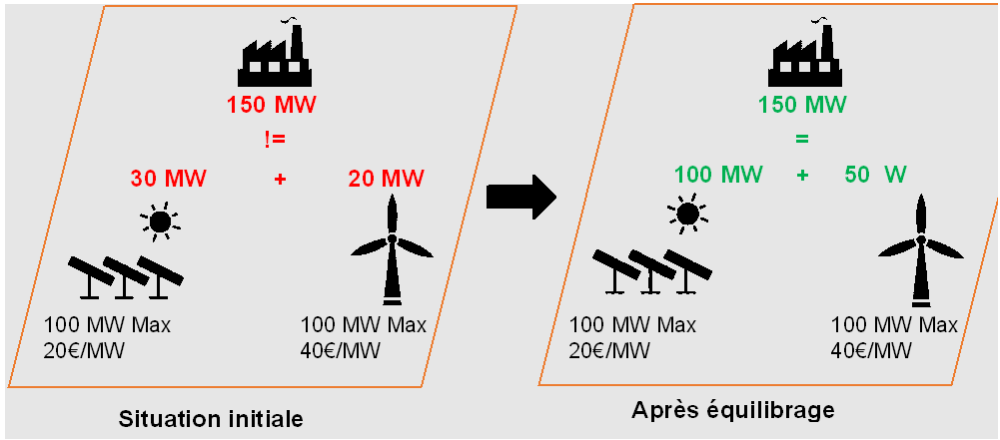
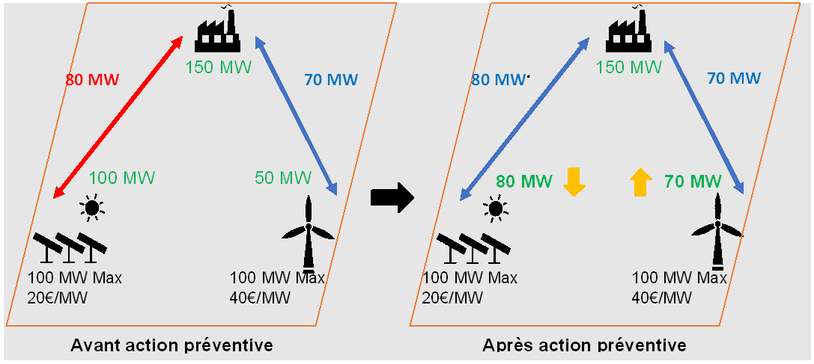

# Rappel but Metrix

Dans le cadre des activités de RTE, il faut un outil capable, pour un réseau donné, **de simuler son fonctionnement heure par heure** et de fournir une **estimation de son coût d’exploitation, en situation normale et face à différents incidents**. Cela est, par exemple, nécessaire pour l’étude du développement du réseau électrique. 

# Couple {Entrées : Sorties}

Le but de Metrix est de de fournir une estimation du coût d’exploitation horaire d’un réseau fonctionnant de manière optimal, i.e. coûtant le plus faible possible.

Considérons un réseau donné. Le comportement d’un réseau étant aléatoire, le coût d’exploitation l'est également. Posons $X$ la variable aléatoire du coût d’exploitation de ce réseau. Ce que nous voulons calculer avec Metrix, c’est une minimisation de l’espérance de cette variable aléatoire :

$$
\begin{aligned}
min(\mathbb{E}(X))
\end{aligned}
$$

Puisque nous ne disposons pas de loi pour déterminer cette espérance, nous allons utiliser une approche statistique et l’approximer comme la moyenne d’un grand nombre de réalisations équiprobables. Il va donc falloir déterminer le coût d’exploitation du réseau sur un grand nombre d’heures (que nous nommerons variantes). En notant $n$ le nombre de réalisations :

$$
\begin{aligned}
min(\mathbb{E}(X)) \approx  min(\frac{1}{n}\sum_{i=0}^{n}x_i)
\end{aligned}
$$

D'autre part, pour simplifier le modèle et paralléliser les simulations des variantes, il a été décidé de les rendre indépendante les unes des autres : la réalisation de la variable sur une variante est totalement indépendante de sa réalisation sur une autre variante. Par conséquent, minimiser la somme des coûts revient à minimiser chaque coût horaire :

$$
\begin{aligned}
min(\mathbb{E}(X)) \approx  min(\frac{1}{n}\sum_{i=0}^{n}x_i) = \frac{1}{n}\sum_{i=0}^{n}min(x_i)
\end{aligned}
$$

Pour estimer le minimum de l’espérance de $X$, nous allons donc devoir minimiser le coût de fonctionnement du réseau de chaque variante, et ce, sur un grand nombre de variantes. Cela équivaut à simuler, pour chaque variante, un fonctionnement optimal du réseau. Pour ce faire, nous allons utiliser les outils de **Recherche Opérationnelle**.
Par ailleurs, pour avoir des variantes différentes, nous allons avoir besoin de situations différentes dans le réseau : en termes de coûts de production, de groupes indisponibles, de consommations des centres de consommation, etc. Ces paramètres du réseau seront représentés par des variables aléatoires, chaque variante ayant sa réalisation. Metrix résout donc un problème d’**optimisation stochastique**.

## Énoncé du problème
Pour simuler le fonctionnement réel et optimal du réseau sur une variante, nous allons décomposer le problème en deux problèmes d’optimisation, résolus l’un après l’autre.

### Premier problème
Tout d’abord, un premier problème d’équilibrage entre production et consommation (***Adequacy phase***), simulant le fait que, suite à un changement de la consommation, les producteurs d’électricité adaptent leur production pour répondre à la nouvelle demande, tout en assurant un coût d’opération minimal. Si la capacité de production est insuffisante, du délestage de consommation est également possible. Le réseau électrique n'est pas pris en compte dans cette phase, nous supposons que tous les éléments producteurs et consommateurs se trouvent sur une même plaque de cuivre sans résistance. Avec la résolution de ce problème, nous obtenons une **égalité production – consommation**. 

Toutes les **variables du problème étant continues**, nous utilisons la **Programmation Linéaire**. Pour garder une approche statistique, le choix des groupes (pour des coûts égaux) se fait **aléatoirement**. Toutefois, pour éviter d’avoir une solution différente à chaque résolution, ce choix aléatoire est identique pour un même environnement informatique. 
Cette étape est explicitée dans [le schéma ci-après](#adequacy_fig) : on part d’une situation initiale déséquilibrée entre la demande (150 MW) et la production (30 + 20 MW). Les groupes augmentent donc leur production, en appelant d’abord les productions les moins chères.

{width=200px}

:::{figure-md}
{width=200px}

Équilibrage du réseau en *Adequacy phase*
:::

:::{figure-md} adequacy-fig

Équilibrage du réseau en *Adequacy phase*
:::

### Deuxième problème
Mais puisque les lignes électriques n’ont pas été prises en compte, ce **nouvel équilibre peut entraîner des surcharges sur celles-ci**. Dans une deuxième phase (***Redispatching phase***), il faut donc considérer le réseau dans son intégralité et choisir des **actions préventives** pour éviter les surcharges tout en assurant l’équilibrage Production – Consommation. Ces actions préventives regroupent les moyens d’actions de RTE sur le réseau, à savoir la **modification des déphasages des Transformateurs-Déphaseurs et des flux sur les Lignes à Courant Continu**. Nous avons également la possibilité de modifier la production ou la consommation. Néanmoins, ces actions concernent des acteurs extérieurs à RTE, leur utilisation sera donc défavorisée par un coût plus élevé dans la simulation. 
En outre, des incidents peuvent se produire sur le réseau et perturber son fonctionnement (perte d’un groupe de production, d’une ligne, etc.) ; il faut donc choisir des **actions curatives** pour éviter d’autres surcharges. Ces actions sont les mêmes qu’en préventif, avec, en supplément, des **parades topologiques** : ces dernières ouvrent ou ferment des lignes ou des couplages du réseau, de façon à en modifier la topologie, et donc à modifier les flux sur les lignes. 
La résolution de ce deuxième problème d’optimisation va donc permettre de simuler le choix des actions préventives et curatives garantissant le bon fonctionnement du réseau pour un coût minimal. Certaines actions curatives étant du type “interrupteur”, **des variables booléennes** apparaissent dans le problème : on résout ainsi un **Problème Linéaire Mixte en Nombres Entiers**. 
Le [schéma ci-après](#redis_fig) montre la partie préventive de ce second problème : après l’équilibrage du réseau, les contraintes de seuil des lignes sont ajoutées, ce qui provoque la surcharge d'une ligne. Pour que son seuil ne soit pas dépassé, nous modifions les productions des groupes tout en maintenant l’équilibre offre – demande, ce qui entraîne un surcoût de 200€.

 {width=200px}
