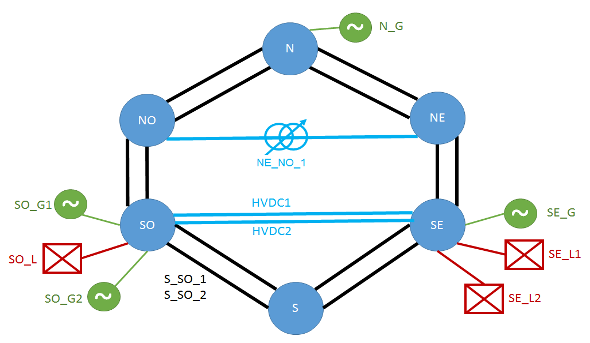

# Tutorial

## Case study introduction

Required files : 
- [network case in iidm format](../example/reseau_6noeuds.xiidm)
- [csv timeseries](../example/time-series-tp.csv)

The network case comprise 6 substations, 4 generators and 3 loads :

\
And the timeseries should look like:

| Time	| Version |	SE_L1 | SO_G1 |	SO_G2 |	seuilN |	seuilAM |
| ----- | ------- | ----- | ----- | ----- | ------ | ---------- |
|2015-01-01T01:00+01:00|	1|	960|	0|	960|	400|	480|
2015-01-01T02:00+01:00	|1	|960|	960|	0|	400|	480|
2015-01-01T03:00+01:00	|1	|960	|960	|0	|100	|480|

## Mapping

